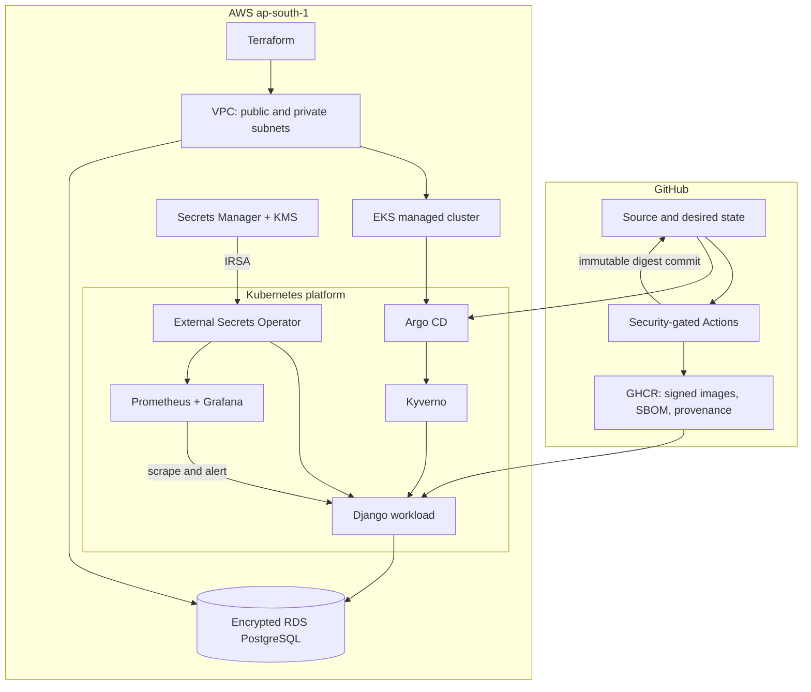
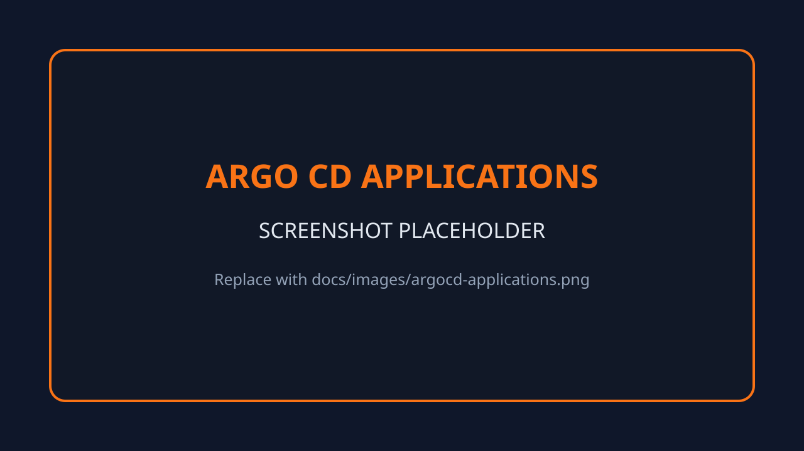
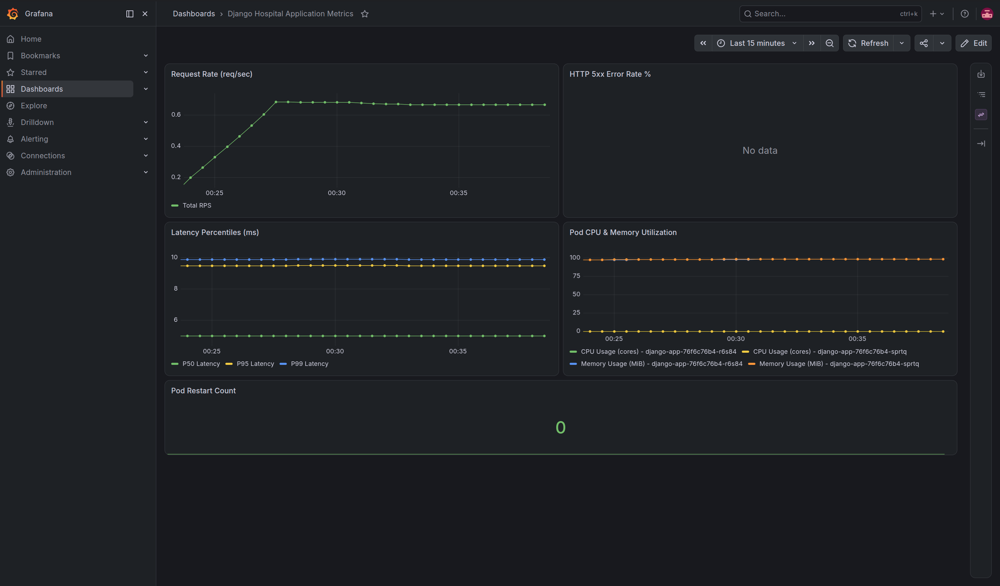
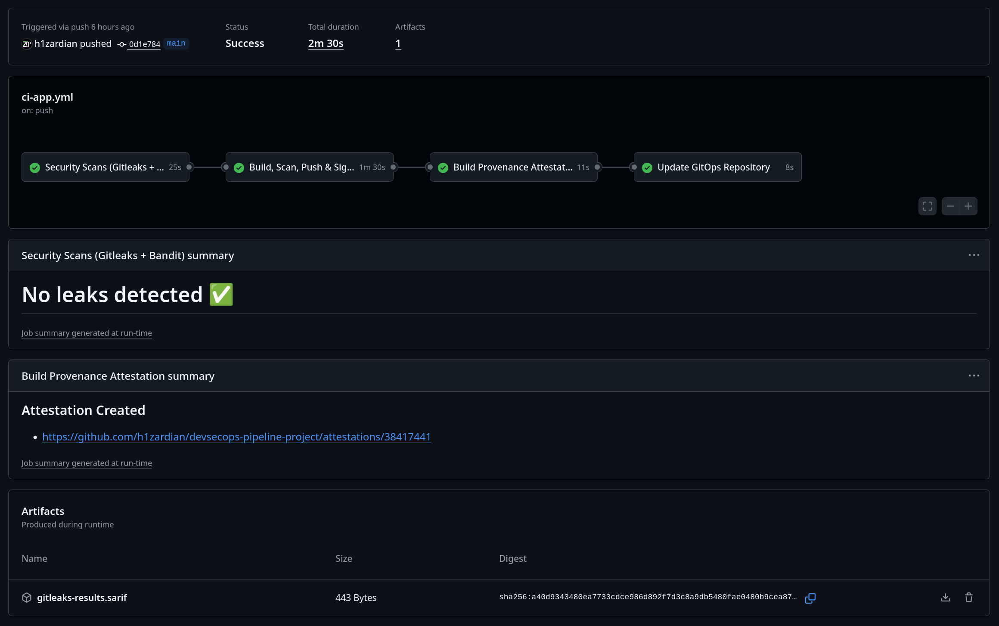

# Secure GitOps Platform on AWS

[](https://github.com/h1zardian/devsecops-pipeline-project/actions/workflows/ci-app.yml)
[](https://github.com/h1zardian/devsecops-pipeline-project/actions/workflows/ci-terraform.yml)
[](https://github.com/h1zardian/devsecops-pipeline-project/actions/workflows/ci-k8s-manifests.yml)

[](docs/pipeline-flow.md#stage-4-sbom-signature-and-provenance)
[](LICENSE)

This portfolio project demonstrates a security-first delivery platform I
designed, deployed, operated, and cleanly decommissioned—not merely an
application deployment. It provisions a complete AWS environment with
Terraform, bootstraps Kubernetes controllers with Ansible, continuously delivers
signed container images with GitHub Actions and Argo CD, enforces admission
policy with Kyverno, synchronizes secrets through workload identity, and exposes
application and platform health through Prometheus and Grafana.

The sample Django workload gives the platform something realistic to build,
scan, test, sign, deploy, scale, observe, and remove. The engineering focus is
the DevSecOps system around it.

## What this project demonstrates

| Capability | Implementation | Evidence in the repository |
| --- | --- | --- |
| Infrastructure as Code | VPC, private subnets, NAT, EKS 1.34, managed nodes, encrypted RDS PostgreSQL, KMS, IAM, and Secrets Manager | [`infra/terraform/`](infra/terraform/) |
| Secure CI | Secret scanning, SAST, dependency auditing, IaC scanning, manifest validation, and container CVE gates | [`.github/workflows/`](.github/workflows/) |
| Software supply-chain security | Immutable image digests, CycloneDX SBOM, keyless Cosign signatures, GitHub OIDC identity, and build provenance | [`ci-app.yml`](.github/workflows/ci-app.yml) |
| GitOps delivery | Automated sync, pruning, drift detection, and self-healing with an Argo CD app-of-apps model | [`k8s/argocd-apps/`](k8s/argocd-apps/) |
| Runtime guardrails | Enforced non-root execution, resource limits, approved registry, no mutable `latest`, and signature verification | [`k8s/policies/`](k8s/policies/) |
| Keyless cloud access | GitHub Actions OIDC for Terraform and EKS IRSA for External Secrets Operator | [`infra/terraform/modules/oidc/`](infra/terraform/modules/oidc/) |
| Secrets lifecycle | KMS-encrypted AWS Secrets Manager values synchronized into narrowly scoped Kubernetes Secrets | [`externalsecret.yaml`](k8s/apps/django-app/templates/externalsecret.yaml) |
| Observability | Prometheus scraping, alert rules, HPA metrics, cluster telemetry, and a provisioned Grafana dashboard | [`k8s/apps/monitoring-stack/`](k8s/apps/monitoring-stack/) |
| Repeatable operations | Idempotent bootstrap, health checks, dynamic endpoint discovery, cloud-resource cleanup, and verified teardown | [`docs/user-guide.md`](docs/user-guide.md) |
| Dependency maintenance | Grouped Dependabot updates across Python, Docker, Actions, and Terraform | [`.github/dependabot.yml`](.github/dependabot.yml) |

## Architecture at a glance



Terraform owns AWS resources. Ansible owns the one-time controller bootstrap.
Argo CD owns ongoing Kubernetes desired state. Keeping those boundaries explicit
prevents configuration drift and makes creation, recovery, and teardown
predictable.

Read the [architecture deep dive](docs/architecture.md) for network placement,
trust boundaries, secrets flow, reconciliation ownership, availability choices,
and teardown boundaries.

## Demonstration evidence

The panels below are intentionally labeled placeholders until sanitized captures
from the next short-lived deployment replace the files. Replacement instructions
and the exact filenames are in [`docs/images/`](docs/images/README.md).

| Public application | Argo CD reconciliation |
| --- | --- |
|  |  |
| **Grafana observability** | **GitHub Actions delivery** |
|  |  |

## Secure delivery flow

An application change follows this path:

1. Gitleaks scans repository history for secrets.
2. Django smoke tests verify the public application and health endpoints.
3. Bandit scans Python code and pip-audit gates vulnerable dependencies.
4. Buildah creates the image without requiring a Docker daemon.
5. Trivy blocks fixable `HIGH` and `CRITICAL` image vulnerabilities.
6. The image is pushed to GHCR with a commit-derived tag.
7. Syft creates a CycloneDX SBOM, and Cosign publishes an attestation and
   keyless signature using GitHub's OIDC identity.
8. GitHub publishes build provenance for the immutable image digest.
9. The workflow commits that digest to the Helm values.
10. Argo CD reconciles the commit; Kyverno verifies the expected workflow
   identity and digest before Kubernetes admits the pod.

Infrastructure mutation is deliberately separate: Terraform changes are linted
and scanned on pushes and pull requests, but `terraform apply` runs only through
an explicit manual dispatch using the protected `production-infrastructure`
environment and short-lived AWS credentials.

See [pipeline flow and security gates](docs/pipeline-flow.md) for triggers,
permissions, artifacts, trust decisions, failure semantics, and the GitOps
handoff.

## Security design highlights

- No long-lived AWS access key is required by GitHub Actions or Kubernetes
  workloads.
- EKS Secrets are envelope-encrypted with a customer-managed KMS key; node root
  volumes and RDS storage are encrypted.
- EKS nodes require IMDSv2 and run in private subnets.
- The EKS API is private by default; workstation access is limited to explicit
  trusted CIDRs.
- RDS accepts PostgreSQL traffic only from the VPC and has no public endpoint.
- The Django container runs as a non-root user with a read-only root filesystem,
  dropped capabilities, resource limits, health probes, and a constrained
  NetworkPolicy.
- Kyverno validates both workload shape and the keyless signing identity before
  admission.
- Secrets Manager access is limited to the environment path and KMS key required
  by ESO.
- Actions are pinned to full commit SHAs, and dependencies are monitored by
  Dependabot and scheduled controller-image scanning.
- Upstream controller-image findings remain visible and blocking without blanket
  suppression; ownership and the next review date are tracked in
  [security issue #15](https://github.com/h1zardian/devsecops-pipeline-project/issues/15).

## Reliability and operability

- Two EKS worker nodes span two availability zones.
- The application starts with two replicas and can scale to five through HPA.
- Readiness and liveness probes control traffic and recovery.
- Argo CD automatically prunes stale resources and self-heals drift.
- Database migrations run as a Helm lifecycle Job before the new application
  becomes the stable desired state.
- Prometheus discovers the application through a `ServiceMonitor`, evaluates
  error-rate, crash-loop, and saturation alerts, and feeds a provisioned Grafana
  dashboard.
- `make status` summarizes nodes, GitOps health, secrets, pods, and public load
  balancers.
- `make down` removes Kubernetes-created load balancers and security groups
  before Terraform destroys their VPC dependencies.

## Repository map

```text
.
├── .github/
│   ├── workflows/             # CI, security gates, attestations, and IaC checks
│   └── dependabot.yml         # Automated dependency update policy
├── app/                       # Sample Django workload and hardened container build
├── docs/
│   ├── architecture.md        # System design and trust boundaries
│   ├── images/                # Replaceable demonstration evidence
│   ├── pipeline-flow.md       # CI/CD and GitOps control flow
│   └── user-guide.md          # Complete deploy, operate, and teardown runbook
├── infra/
│   ├── ansible/               # Day-0 cluster controller bootstrap
│   ├── scripts/               # State bootstrap and AWS cleanup safeguards
│   └── terraform/             # AWS infrastructure modules and environment inputs
├── k8s/
│   ├── apps/                  # Django and monitoring Helm charts
│   ├── argocd-apps/           # App-of-apps desired state
│   └── policies/              # Enforced Kyverno controls
├── Makefile                   # Consistent lifecycle entry points
└── docker-compose.yml         # Low-cost local application iteration
```

## Run it

The reusable lifecycle is:

```bash
make init-state
# Configure the ignored dev.tfvars and fork-specific GitOps values first.
make up
make status
make down
```

On a clean AWS account, Terraform must first create RDS so its generated hostname
can be committed to the fork before Argo CD is bootstrapped. Do not run the
abbreviated lifecycle alone for that first deployment. The
[user guide](docs/user-guide.md) provides the exact staged sequence plus
prerequisites, account-specific S3 state configuration, signing-identity setup,
EKS API access, verification, credentials, endpoint discovery, common failures,
and permanent backend cleanup.

## Design tradeoffs and scope

This is a deployable portfolio lab with deliberate cost and usability choices,
not a claim of production certification:

- The `dev` database is single-AZ, uses a small instance, and is destroyed
  without a final snapshot. A production environment would use Multi-AZ,
  deletion protection, backups, tested restore procedures, and stricter data
  controls.
- One NAT gateway reduces demonstration cost but is an availability dependency.
- AWS-hostname mode creates three public load balancers and uses HTTP because an
  AWS-generated hostname cannot receive a browser-trusted certificate. The
  retained custom-domain mode consolidates routing behind Traefik and enables
  Let's Encrypt TLS.
- Public Argo CD and Grafana endpoints are convenient for a demonstration. For
  sustained operation, use custom TLS domains, identity-aware access, network
  restrictions, or private access.
- The stack creates meaningful hourly AWS charges. Destroy it when it is not
  being demonstrated, and follow the guide's post-destroy checks.

These tradeoffs are documented so an evaluator can distinguish conscious
engineering decisions from accidental omissions.

## Documentation

- [User guide: deploy, use, troubleshoot, and decommission](docs/user-guide.md)
- [Architecture and system boundaries](docs/architecture.md)
- [Pipeline flow and security gates](docs/pipeline-flow.md)
- [Security reporting policy](.github/SECURITY.md)

## Local application-only mode

Docker Compose provides a zero-AWS-cost path for application iteration. It does
not reproduce EKS, Kyverno, Argo CD, ESO, or the cloud trust boundaries.

```bash
make dev-up
curl http://localhost:8000/
make dev-down
```

## License

Released under the [MIT License](LICENSE).
