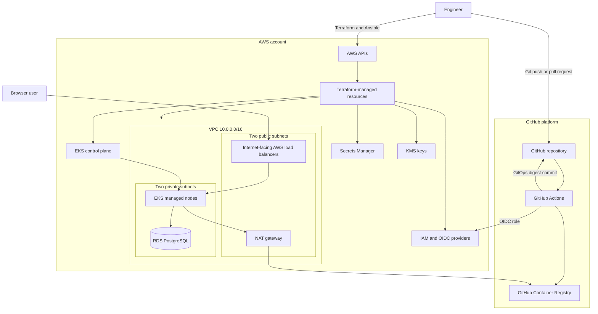
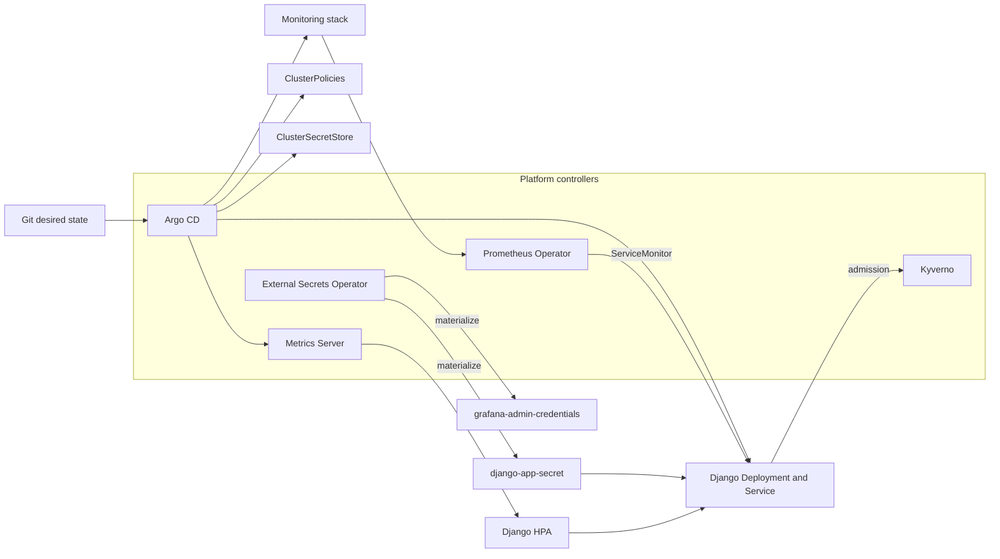
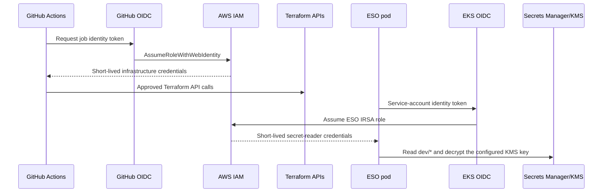

# Architecture and System Boundaries

[Project overview](../README.md) · [Operator guide](user-guide.md) · [Delivery pipelines](pipeline-flow.md)

This document describes the implemented architecture, the ownership boundary of
each automation layer, and the security and availability decisions behind the
portfolio platform. The default deployment targets the `dev` environment in AWS
`ap-south-1`.

## System context

## Automation ownership

The platform intentionally uses three control planes rather than letting several
tools compete for the same object.

| Owner | Manages | Does not manage |
| --- | --- | --- |
| Terraform | VPC, subnets, routes, NAT/EIP, EKS, nodes, RDS, KMS, Secrets Manager, IAM, OIDC, and remote-state references | Helm releases and application rollouts |
| Ansible | Initial Helm installation of Argo CD, Kyverno, and ESO; optional Traefik/cert-manager; initial Argo CD Application objects | Day-1 application image promotion |
| Argo CD | Django chart, monitoring chart, Kyverno policies, ClusterSecretStore, metrics server, pruning, and drift reconciliation | AWS infrastructure |
| GitHub Actions | Application tests, validation, image build, CVE gate, signing, attestations, desired image-digest commit, read-only infrastructure plan, and approved infrastructure apply | Direct Kubernetes mutation |
| Kubernetes controllers | Scheduling, rollout, HPA, load-balancer provisioning, secret synchronization, admission, and monitoring reconciliation | Source-of-truth changes |

Terraform is run before Ansible because the bootstrap requires a reachable EKS
API and Terraform's ESO role ARN. Ansible registers Argo CD's root applications;
after that handoff, Git is the source of truth for the managed Kubernetes layer.

## AWS resource topology

### Network

The VPC module creates:

- One `/16` VPC across the first two available zones in `ap-south-1`.
- Two public subnets tagged for Kubernetes internet-facing load balancers.
- Two private subnets tagged for internal Kubernetes load balancers.
- One internet gateway.
- One NAT gateway and Elastic IP for private-node egress.
- DNS support and DNS hostnames.

EKS managed nodes and RDS use the private subnets. The public subnets host the
NAT path and the AWS load balancers created from Kubernetes `LoadBalancer`
Services. The single NAT gateway is a conscious demonstration-cost tradeoff; a
production design would normally deploy one per availability zone.

### EKS

The cluster runs Kubernetes 1.34 with:

- A private API endpoint enabled at all times.
- An optional public API endpoint restricted to explicitly configured CIDRs.
- Two `t3.medium` managed nodes, scalable to three.
- Encrypted 50 GiB `gp3` root volumes.
- IMDSv2 required with a hop limit of one.
- Customer-managed KMS envelope encryption for Kubernetes Secrets.
- Cluster-creator administrator access for the provisioning identity.

The EKS control plane is AWS-managed and is not placed directly inside the VPC.
Elastic network interfaces provide the private connectivity represented in the
diagram.

### RDS and secrets

The development database is PostgreSQL 15 on `db.t3.micro`, encrypted by a
customer-managed KMS key. It is private, accepts port `5432` only from the VPC
CIDR, enables enhanced monitoring and Performance Insights, and exports engine
and upgrade logs.

Terraform generates and stores these values in the KMS-encrypted `dev/django`
Secrets Manager secret:

- Django secret key.
- RDS master password supplied to Terraform.
- Grafana admin username.
- Grafana admin password.

Terraform state necessarily contains sensitive inputs and generated secret
material. The remote S3 bucket is encrypted and versioned, but its IAM access is
therefore part of the platform's secret-management boundary.

The `dev` database is intentionally disposable: it is single-AZ, has no deletion
protection, and does not create a final snapshot during destroy. The Terraform
module enables stronger Multi-AZ and deletion settings when the environment is
`prod`, but backup and restore validation remain operational responsibilities.

## Kubernetes platform

### Argo CD application hierarchy

The Ansible bootstrap creates:

- `django-app`, the direct Django Helm application.
- `platform-app-of-apps`, which recursively reads `k8s/argocd-apps/`.

The app-of-apps directory declares:

- The AWS Secrets Manager `ClusterSecretStore`.
- Cluster-wide Kyverno policies.
- Metrics Server.
- The monitoring stack.
- The same Django application declaratively, allowing Git to retain ownership
  after bootstrap.

Automated sync, pruning, and self-healing are enabled. Manual changes to managed
objects are therefore temporary by design.

### Django workload

The Helm chart creates:

- A two-replica Deployment with immutable digest support.
- An internet-facing `LoadBalancer` Service in the default exposure mode.
- Readiness and liveness probes on `/healthz`.
- A migration Job ordered by Argo CD sync waves after configuration and before
  Deployment rollout; direct Helm installs use post-install/pre-upgrade hooks.
- An HPA with a two-to-five replica range.
- A NetworkPolicy for DNS, PostgreSQL, HTTPS egress, and intended ingress.
- A ConfigMap plus an ESO-managed Secret.
- A `ServiceMonitor` and application alert rules.

The pod runs as UID/GID `10001`, uses `RuntimeDefault` seccomp, drops every Linux
capability, disables privilege escalation, uses a read-only root filesystem, and
does not mount a service-account token.

### Admission control

Kyverno enforces five policy groups for Django namespace pods:

1. Reject mutable `latest` tags.
2. Require non-root execution and hardened security contexts.
3. Require CPU and memory requests and limits.
4. Restrict images to the approved GHCR repository.
5. Verify a Cosign signature from the expected `ci-app.yml` workflow on
   `main`, using GitHub's OIDC issuer and Rekor transparency log.

The image digest is checked at admission. A correctly shaped but unsigned image
cannot be promoted by changing Helm values alone.

## Identity and trust boundaries

There are three distinct principals:

- The human or automation identity performing the initial local bootstrap.
- A read-only GitHub Actions plan role, trusted only for the configured
  repository's `production-infrastructure-plan` environment. It can refresh the
  graph and manage only the S3 lock object.
- A separate GitHub Actions apply role, trusted only for the configured
  repository's protected `production-infrastructure` environment.
- The ESO role, trusted only for the
  `system:serviceaccount:external-secrets:external-secrets` identity.

No role is shared between Terraform and the in-cluster secret reader.

## Secrets data flow

1. Terraform writes the source values to `dev/django` using the RDS KMS key.
2. ESO's service account receives an EKS OIDC token.
3. AWS IAM validates the exact service-account subject and returns temporary
   credentials.
4. ESO reads only the allowed environment secret path and decrypts with the
   allowed KMS key.
5. The Django `ExternalSecret` selects only `secret_key` and `db_password`.
6. The monitoring `ExternalSecret` selects only the Grafana admin values.
7. Kubernetes Secrets are owned by ESO and refreshed hourly.
8. Workload environment variables consume the synchronized values.

The model avoids static AWS keys and avoids putting plaintext values in Git, but
authorized cluster administrators can still read Kubernetes Secrets. RBAC and
administrator access remain part of the trust boundary.

## Observability flow

The Django application exposes Prometheus metrics at `/metrics`. Its
`ServiceMonitor` tells the Prometheus Operator how to discover and scrape that
endpoint every 30 seconds. Prometheus also receives node, pod, Kubernetes object,
and controller metrics from the kube-prometheus-stack components.

The repository includes alerts for:

- HTTP 5xx error rate above five percent.
- Django pod restart activity.
- The HPA remaining at its maximum replica count.

Grafana receives its credentials through ESO and loads the Django dashboard from
a labeled ConfigMap through its dashboard sidecar. Alert routing is available
through Alertmanager; external receivers require operator configuration.

## Exposure modes

### AWS-generated hostnames

This is the default and needs no DNS ownership. Django, Argo CD, and Grafana each
use a public AWS load balancer. The endpoints are HTTP because browser-trusted
certificates cannot be issued for AWS-owned ELB hostnames.

### Custom domains

The optional mode installs Traefik and cert-manager. The three public services
become `ClusterIP`, Ingress objects route custom hostnames through one Traefik
load balancer, and cert-manager requests Let's Encrypt certificates. The code is
retained, but DNS ownership and correct records are external prerequisites.

## Availability and scaling model

| Component | Development choice | Production evolution |
| --- | --- | --- |
| EKS nodes | Two nodes across two zones | Larger autoscaled groups, disruption budgets, capacity diversity |
| Django | Two replicas, HPA to five | Load testing, tuned HPA/VPA, topology spread, explicit PDB |
| RDS | Single-AZ `db.t3.micro` | Multi-AZ, deletion protection, backups, restore tests, replicas where needed |
| NAT | One gateway | One gateway per zone or evaluated egress architecture |
| Public entry | Three Classic AWS load balancers in default mode | ALB/NLB or consolidated ingress with TLS and access controls |
| GitOps | Single in-cluster Argo CD installation | HA Argo CD, SSO, restricted projects, notifications |
| Monitoring | In-cluster stack | Durable storage, external retention, receiver integrations, SLOs |

## Lifecycle and teardown boundaries

Kubernetes `LoadBalancer` Services create AWS resources outside Terraform's
state. Destroying the VPC before those resources disappear causes dependency
failures. The project therefore runs a scoped cleanup script first, which finds
load balancers in the project VPC, records their dedicated security groups,
deletes the load balancers, and removes only Kubernetes-owned groups. Terraform
then destroys the managed graph.

The S3 backend is deliberately not part of that graph because it contains the
graph's state. Normal teardown retains it for the next deployment. Permanent
retirement empties all object versions and delete markers and removes the bucket
only after state is empty. AWS KMS keys remain visible but unusable during the
mandatory seven-day pending-deletion period.

The complete procedure and AWS verification queries are in the
[operator guide](user-guide.md#12-clean-teardown).

## Architecture tradeoffs

This project optimizes for demonstrability, security controls, and repeatable
short-lived operation:

- Direct public load balancers make a no-domain demo possible but increase cost
  and do not provide trusted HTTPS.
- A private-by-default EKS API reduces exposure but requires explicit bootstrap
  connectivity.
- GitOps auto-healing improves consistency but means emergency manual edits are
  not durable.
- Strict signature verification improves provenance assurance but requires fork
  operators to update both the image repository and expected workflow identity.
- Secrets Manager plus ESO removes Git secrets but introduces controller, IAM,
  KMS, and synchronization dependencies that must all be observable.
- Disposable database settings make repeated portfolio demos affordable at the
  expense of data durability.

Those choices are visible and reversible rather than hidden in manual account
configuration.

### Tool-selection decisions

| Choice | Why it fits this project | When the alternative may fit better |
| --- | --- | --- |
| Argo CD over Flux | The UI makes sync health, drift and deployment evidence easy to demonstrate to an evaluator. | Flux is attractive for a smaller, CLI-first platform or deeper toolkit composition. |
| Kyverno over OPA/Gatekeeper | Policies use Kubernetes-native YAML and can verify Cosign identities without introducing Rego into this portfolio. | Gatekeeper is useful where an organization already standardizes on Rego and OPA policy libraries. |
| GHCR over ECR | Native repository permissions, `GITHUB_TOKEN`, public portfolio visibility and Sigstore integration minimize bootstrap credentials. | ECR can simplify private, AWS-only registry networking and IAM governance. |
| Ansible over Terraform Helm resources | Keeps day-0 controller recovery out of the AWS infrastructure state and avoids provider-ordering cycles. | Terraform Helm can be reasonable when one team deliberately accepts a single state and lifecycle. |
| S3-native locking over DynamoDB | Current Terraform supports lockfiles directly in the encrypted, versioned backend bucket. | DynamoDB remains relevant to older Terraform estates during migration. |
