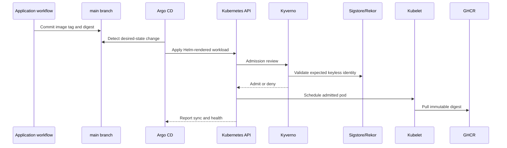
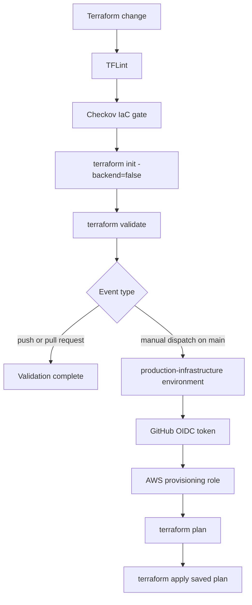

# Delivery Pipelines and Security Gates

[Project overview](../README.md) · [Architecture](architecture.md) · [User guide](user-guide.md)

This document explains what starts each automation path, which trust decision it
makes, what it is allowed to change, and how a successful container becomes a
running workload. The workflows are intentionally separated so validation does
not silently gain deployment permission.

## Workflow inventory

| Workflow | Trigger | Primary gates | May mutate external state? |
| --- | --- | --- | --- |
| `App CI/CD Pipeline` | Push to `main` affecting `app/` or its workflow; every pull request | Gitleaks, Django smoke tests, Bandit, pip-audit, Trivy, signing, SBOM and provenance publication | On `main`: writes GHCR and commits the immutable digest to Git |
| `Terraform Infrastructure CI/CD` | Terraform/workflow push; every pull request; manual dispatch | TFLint, Checkov, init, validate; plan during manual apply | Only the manually dispatched `main` job can assume the AWS role and apply |
| `Kubernetes Manifests & Policy CI` | Kubernetes/workflow push; every pull request | Helm lint/render, kubeconform, Kyverno CLI tests, Checkov | No; validation only |
| `Platform Controller Image CVE Scan` | Weekly schedule, manual dispatch, or pinned platform-version change | Trivy fixable `HIGH`/`CRITICAL` scan | No; reports risk only |
| Dependabot | Weekly by ecosystem | Opens grouped or scoped update pull requests | Pull requests only; normal branch controls still apply |

All third-party actions are pinned to immutable commit SHAs. Workflow-level
permissions start read-only and are expanded only on jobs that publish packages,
attestations, Git commits, or AWS mutations.

## Application pipeline

```mermaid
flowchart LR
    Change[Change under app/] --> Secrets[Gitleaks]
    Secrets --> Tests[Django endpoint tests]
    Tests --> SAST[Bandit]
    SAST --> Dependencies[pip-audit]
    Dependencies --> Build[Buildah image build]
    Build --> CVE[Trivy HIGH/CRITICAL gate]
    CVE --> Push[Push tag to GHCR]
    Push --> Digest[Capture registry digest]
    Digest --> SBOM[Syft CycloneDX SBOM]
    SBOM --> Attest[Cosign SBOM attestation]
    Attest --> Sign[Cosign keyless signature]
    Sign --> Provenance[GitHub build provenance]
    Provenance --> GitOps[Commit tag and digest]
    GitOps --> Argo[Argo CD reconcile]
    Argo --> Admission[Kyverno signature and policy admission]
    Admission --> Rollout[Kubernetes rollout]
```



### Stage 1: source and dependency checks

The `security-scans` job checks out full history so Gitleaks can inspect more
than the final snapshot. It then:

- Scans for secrets with Gitleaks.
- Installs Python 3.12 and the locked application dependencies.
- Runs isolated smoke tests for the public landing page and health endpoint
  against SQLite; the tests do not require AWS or a running PostgreSQL service.
- Runs Bandit recursively against the application, with the settings module
  excluded by the repository's explicit configuration.
- Runs `pip-audit --strict` against the locked application requirements.

Any failure stops image construction.

### Stage 2: build and pre-push CVE gate

The `build-scan-push` job derives `sha-<short-commit>` from the triggering commit
and normalizes the GHCR repository name to lowercase. Buildah constructs the
container and exports it as `django-app.tar`.

Trivy scans that local archive before registry publication. The gate fails on
fixable `HIGH` or `CRITICAL` findings and ignores findings for which no upstream
fix exists. The repository-level `.trivyignore` remains available only for
documented, reviewed exceptions; it is not a blanket bypass.

Pull requests stop after build and scan because every registry, signing, and
Git-write step is conditioned on a push to `main`.

### Stage 3: registry publication and immutable identity

On `main`, the job uses the scoped `GITHUB_TOKEN` to log in to GHCR and pushes
the commit-derived tag. Buildah writes the registry-reported digest to a file,
and that exact `sha256` value becomes the identity used by later stages.

The tag is useful to humans, but the Helm Deployment selects the digest. This
prevents a moved tag from silently changing the admitted workload.

### Stage 4: SBOM, signature, and provenance

Syft generates a CycloneDX JSON SBOM from the same local image archive that
passed Trivy. Cosign publishes the SBOM as an attestation against the immutable
image reference and then creates a keyless image signature.

The Cosign release is deliberately pinned to the 2.x attachment format currently
discovered by the deployed Kyverno verification path. GitHub Actions OIDC
provides the signing identity; no private signing key is stored in repository
secrets. Rekor provides transparency-log evidence.

The separate provenance job uses `actions/attest` with `attestations: write` and
`id-token: write` to publish GitHub build provenance for the same subject name
and digest. These controls are SLSA-aligned, but the repository does not claim a
formal SLSA certification level.

### Stage 5: GitOps promotion

The final job has only `contents: write`. It updates three Helm values:

- Image repository.
- Human-readable commit tag.
- Immutable registry digest.

It commits as `github-actions[bot]` and pushes to `main`. That commit changes only
`k8s/`, so it starts Kubernetes manifest validation but does not recursively
start another application build.

The job is associated with GitHub's `production` environment. GitHub therefore
records a successful deployment when the GitOps handoff is committed. This is a
delivery-system status, not proof that Kubernetes finished the rollout. Argo CD
health and `kubectl rollout status` are the runtime verification sources.

## GitOps reconciliation and admission



Admission checks are independent of CI success. Even someone with Git write
access cannot deploy an image from an unapproved repository or identity without
also changing an enforced policy through its own reviewed desired-state path.

Argo CD uses automated sync, pruning, and self-healing. A failed migration,
denied image, missing secret, or unhealthy rollout surfaces as a degraded or
progressing Argo application rather than being masked by the green GitHub
handoff record.

## Terraform pipeline



### Validation path

TFLint initializes its plugins and checks the Terraform tree. Checkov performs a
hard-fail Terraform scan. Terraform initializes without the remote backend for
syntax and provider validation. These checks run without AWS write permission.

### Apply path

The apply job has three independent controls:

1. It runs only for `workflow_dispatch` on `main`.
2. It is attached to the `production-infrastructure` GitHub environment, where
   repository owners can add reviewers or wait rules.
3. AWS IAM trusts the repository's matching environment OIDC subject rather than
   a stored AWS access key.

The job receives only `id-token: write` and `contents: read`. It creates a saved
plan with the configured environment values and applies that exact plan.

### OIDC bootstrap boundary

Terraform itself creates the GitHub OIDC provider and provisioning role. A clean
account therefore needs one initial local apply by an authorized human identity.
After that apply, the role ARN and database password can be stored as secrets in
the protected GitHub environment, enabling future manually approved runs.

Terraform deployment status uses `production-infrastructure`, separate from the
application's `production` deployment status. A failed infrastructure apply no
longer misrepresents a healthy application release.

## Kubernetes manifest and policy pipeline

This validation workflow protects the GitOps source before Argo CD reads it.

### Helm and schema validation

The job:

1. Downloads a checksum-verified kubeconform binary.
2. Builds the pinned monitoring chart dependency.
3. Lints both local charts.
4. Renders the Django chart for its real namespace.
5. Runs strict kubeconform validation, ignoring only schemas unavailable from
   the public schema catalog, such as some CRDs.
6. Renders and validates the monitoring wrapper chart.

### Policy tests

The workflow downloads a checksum-verified Kyverno CLI and evaluates the
non-root, resource, mutable-tag, repository, and signature policies against the
repository fixture. Signature validation uses the registry and therefore tests
the real identity contract rather than only YAML shape.

Checkov then scans the rendered Django resources. The one skipped check is
documented inline: the application consumes ESO-managed secrets through
environment variables.

The workflow is read-only. Argo CD remains the only automated writer to the
cluster for these resources.

## Platform controller image scan

The scheduled workflow runs at 03:23 UTC each Monday and can also be dispatched
manually. It scans the pinned primary images for Argo CD, Kyverno, ESO,
cert-manager, Traefik, Grafana, Prometheus, and Metrics Server with Trivy 0.72.0.

The matrix does not mutate deployments or automatically suppress findings. A
failure means a pinned platform image contains a fixable high-severity finding
under Trivy's current database. Operators should determine whether a patched
upstream chart or image exists before changing the pin. An upstream-only finding
can remain visible without blocking unrelated application delivery.

## Dependabot flow

Dependabot checks these ecosystems weekly:

- Python requirements under `app/`.
- The application Dockerfile.
- GitHub Actions.
- Root Terraform providers and the EKS/VPC child modules.

Python, Actions, and root Terraform changes are grouped to reduce pull-request
noise. Dependabot does not bypass the workflows: an update must pass the same
security and validation gates before merge. Platform chart versions pinned in
Ansible or Helm remain explicit operator-reviewed changes.

## Permissions and trust summary

| Job or controller | Credential source | Effective purpose |
| --- | --- | --- |
| App scan | Read-only `GITHUB_TOKEN` | Checkout and secret scanning |
| Image publication | Scoped `GITHUB_TOKEN` plus GitHub OIDC | Write GHCR, sign, and attest |
| Provenance | GitHub OIDC and attestation permission | Publish digest-bound provenance |
| GitOps update | `GITHUB_TOKEN` with contents write | Update one desired-state file |
| Terraform validation | No AWS credential | Static checks and local validation |
| Terraform apply | GitHub environment OIDC | Assume scoped AWS provisioning role |
| Argo CD | In-cluster service account | Reconcile declared Kubernetes resources |
| ESO | EKS service-account OIDC | Read the environment's Secrets Manager path and decrypt one KMS key |
| Django pod | No mounted service-account token | Serve the app and connect to RDS using synchronized values |

## Reading failures correctly

| Failure | What it means | First investigation point |
| --- | --- | --- |
| Django tests | A public application contract regressed | Test name, response status, and traceback |
| Gitleaks/Bandit/pip-audit | Source or dependency gate rejected the change | Failed step logs and exact finding |
| Trivy application scan | Built runtime image has a gated fixable CVE | Package, fixed version, and base image |
| Cosign or attestation | Identity, registry permission, or publication failure | OIDC permissions and GHCR package access |
| GitOps update | Desired digest was not committed | Branch permission and concurrent main updates |
| Manifest/policy validation | Desired state is structurally invalid or violates policy | Rendered manifest and policy rule output |
| Argo `OutOfSync` | Git and cluster state differ | Argo resource diff and reconciliation event |
| Argo `Degraded` | Desired state applied but a runtime resource is unhealthy | Pods, Jobs, events, ESO, and admission reports |
| Terraform validation | IaC quality or security gate failed | TFLint, Checkov, or validate output |
| Terraform apply | Approved AWS mutation failed | Plan/apply log, remote-state lock, and AWS event |
| Platform image scan | A pinned controller image has a current fixable CVE | Upstream image/chart release and Trivy details |

GitHub keeps historical deployment failures as an audit trail. The newest status
for each environment is the current delivery record; old red entries should not
be relabeled as successes.

## Local equivalents

Useful pre-push checks include:

```bash
make lint
terraform -chdir=infra/terraform fmt -check -recursive
terraform -chdir=infra/terraform validate
helm dependency build k8s/apps/monitoring-stack
helm lint k8s/apps/django-app k8s/apps/monitoring-stack
```

The CI workflows remain authoritative because they run in a clean runner with
the pinned action versions and publication identity.
