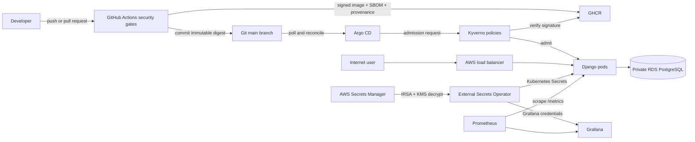

# Operator Guide: Deploy, Use, and Decommission

[Project overview](../README.md) · [Architecture](architecture.md) · [Delivery pipelines](pipeline-flow.md)

This guide explains how the platform is assembled, how its components interact,
how to create and verify it from a clean AWS account, how to operate it, and how
to remove it cleanly. Commands assume the repository defaults: the `dev`
environment, AWS region `ap-south-1`, and EKS cluster
`devsecops-eks-cluster-dev`.

A fully independent deployment requires a GitHub fork or another writable remote
repository. Argo CD continuously reads desired state from Git, and the
application workflow must be able to commit the fork's signed image digest. A
downloaded ZIP is sufficient for reviewing or running Docker Compose, but it is
not a writable GitOps source.

## 1. What the stack contains

| Layer | Components | Responsibility |
| --- | --- | --- |
| Continuous integration | GitHub Actions, Gitleaks, Bandit, pip-audit, Trivy, Syft, Cosign, Checkov, TFLint, kubeconform | Tests code and infrastructure, scans dependencies and images, creates an SBOM, signs the application image, and records provenance. |
| Image registry | GitHub Container Registry (GHCR) | Stores immutable application images and their attestations. |
| Cloud infrastructure | Terraform, AWS VPC, NAT gateway, EKS, EC2 worker nodes, RDS PostgreSQL, KMS, Secrets Manager, IAM/OIDC | Creates the AWS network, compute, database, encryption, secrets, and workload identities. |
| Day-0 bootstrap | Ansible and Helm | Installs Argo CD, Kyverno, and External Secrets Operator (ESO), then creates the root Argo CD applications. |
| Continuous delivery | Argo CD | Watches this repository, applies the Helm charts, prunes removed objects, detects drift, and self-heals managed resources. |
| Runtime security | Kyverno and Cosign | Enforces non-root containers, resource limits, approved registries, immutable image references, and image-signature verification. |
| Secrets | AWS Secrets Manager, KMS, ESO, IRSA | Keeps secrets in AWS and synchronizes only the required values into Kubernetes Secrets. No static AWS key is stored in a pod. |
| Observability | Prometheus Operator, Prometheus, Alertmanager, Grafana, kube-state-metrics, node-exporter | Scrapes cluster and Django metrics, evaluates alert rules, and serves the included Django dashboard. |

### Default network exposure

The default AWS-hostname mode creates three internet-facing AWS load balancers:

- Django on HTTP port `8000`.
- Argo CD on HTTP port `80`.
- Grafana on HTTP port `80`.

AWS does not issue a browser-trusted certificate for its generated ELB hostname,
so these endpoints use HTTP. This is suitable for a short-lived portfolio lab,
not for production credentials or sensitive data. The repository retains an
optional custom-domain mode using Traefik, cert-manager, and Let's Encrypt; see
[Custom domains and HTTPS](#11-custom-domains-and-https).

RDS and EKS worker nodes stay in private subnets. The EKS control-plane endpoint
is private unless one or more trusted CIDRs are supplied in `dev.tfvars`.

## 2. How the components interact



The deployment sequence is:

1. Terraform creates the AWS infrastructure, including the EKS OIDC provider,
   ESO IAM role, RDS instance, KMS keys, and the `dev/django` secret.
2. Ansible installs the cluster controllers and registers the Argo CD
   applications.
3. Argo CD creates the secret store, monitoring stack, policies, metrics server,
   and Django workload.
4. ESO assumes its IAM role through EKS IRSA and copies selected properties from
   `dev/django` into the `django-app-secret` and
   `grafana-admin-credentials` Kubernetes Secrets.
5. A change under `app/` starts the application pipeline. A successful run
   pushes and signs an image, then commits its immutable digest to
   `k8s/apps/django-app/values.yaml`.
6. Argo CD sees that commit, Kyverno validates the image and pod controls, the
   migration Job runs, and Kubernetes performs the rollout.

## 3. Prerequisites

Use a dedicated lab AWS account if possible. The deploying identity needs enough
permission to create and destroy VPC, EC2, EKS, RDS, IAM, KMS, Secrets Manager,
CloudWatch Logs, and S3 resources. Also confirm that the account has quota for
an EKS cluster, two `t3.medium` nodes, one NAT gateway/EIP, one RDS instance, and
three load balancers.

Install these local tools:

- Git and GNU Make.
- AWS CLI v2.
- Terraform `>= 1.10` (the workflow currently uses `1.15.8`).
- Ansible Core `>= 2.15`.
- Python 3 with the Kubernetes client and PyYAML.
- The `kubernetes.core` Ansible collection.
- Helm 3 or newer.
- `kubectl` compatible with Kubernetes 1.34.
- `curl`, `jq`, and `openssl` for the verification and credential commands.

Install the Ansible dependencies if they are not already available:

```bash
python3 -m pip install --user kubernetes PyYAML
ansible-galaxy collection install kubernetes.core
```

Verify the workstation and AWS identity before creating anything:

```bash
aws --version
terraform version
ansible --version
helm version
kubectl version --client
aws sts get-caller-identity
aws configure get region
```

Use `ap-south-1` for this repository unless every region-specific value is
updated consistently:

```bash
export AWS_REGION=ap-south-1
export AWS_DEFAULT_REGION=ap-south-1
```

## 4. One-time configuration

### 4.1 Clone and inspect the configuration

Fork the project in GitHub, enable Actions on the fork, and clone that fork. A
public fork is the simplest option because Argo CD and Kubernetes can read it
without repository or registry credentials.

```bash
git clone https://github.com/YOUR_GITHUB_USER/devsecops-pipeline-project.git
cd devsecops-pipeline-project
git status
make help
```

In the fork's **Settings → Actions → General**, allow workflows read and write
permission so the application workflow can publish packages and commit the
GitOps digest. Keep pull-request approval controls enabled for outside
contributors.

### 4.2 Configure the Terraform state backend

The S3 backend bucket is bootstrapped separately because Terraform cannot store
state in a bucket that does not exist yet. For the repository owner's account,
the configured bucket is `devsecops-tf-state-backend-072329308666`.

```bash
make init-state
aws s3api get-bucket-versioning \
  --bucket devsecops-tf-state-backend-072329308666
```

The expected versioning status is `Enabled`.

For a fork or another AWS account, choose a globally unique bucket name and
change the `bucket` value in `infra/terraform/backend.tf` before initialization.
Run the bootstrap with the same name:

```bash
export TF_STATE_BUCKET=devsecops-tf-state-backend-ACCOUNT_ID
make init-state
```

Do not share one state key between unrelated deployments and do not delete the
backend until the corresponding infrastructure has been successfully destroyed.
Terraform state contains sensitive values even when CLI output marks them
`sensitive`; restrict access to the bucket and its version history.

### 4.3 Create the untracked environment file

```bash
cp infra/terraform/environments/dev.tfvars.example \
  infra/terraform/environments/dev.tfvars
chmod 600 infra/terraform/environments/dev.tfvars
git check-ignore infra/terraform/environments/dev.tfvars
```

Edit `infra/terraform/environments/dev.tfvars` and add a strong database
password. A safe hexadecimal value can be generated with `openssl rand -hex 24`:

```hcl
db_password = "REPLACE_WITH_THE_GENERATED_VALUE"
```

Keep this file outside Git. The same value is required on later applies and
destroys, and should also be stored in a password manager. An alternative is to
omit it from the file and export `TF_VAR_db_password`, but that variable must be
present again when `make down` is run.

If Ansible runs on the same workstation, allow only its current public address
to reach the EKS API. Obtain the address, then put the literal `/32` value in
`dev.tfvars`:

```bash
curl -fsS https://checkip.amazonaws.com
```

```hcl
cluster_endpoint_public_access_cidrs = ["203.0.113.10/32"]
```

Replace the example address with the command output. If this list remains empty,
run Ansible and `kubectl` from a host with VPC connectivity. Never use
`0.0.0.0/0` for the EKS API.

Set `github_repo` in `dev.tfvars` to the fork's `owner/repository` value.

### 4.4 Fork customization

Prepare the fork's supply-chain identity before creating AWS resources:

1. Make an intended change under `app/` and push or merge it to the fork's
   `main` branch. This starts `ci-app.yml` and publishes a fork-owned signed
   image, SBOM, and provenance. The final job commits its repository, tag, and
   digest into the Django Helm values.
2. Make the resulting GHCR package publicly readable, or configure a Kubernetes
   image-pull secret before bootstrap.
3. Replace the `repoURL` values under `k8s/argocd-apps/` with the public HTTPS URL
   of the fork.
4. In `k8s/policies/restrict-image-repository.yaml`, replace the approved image
   prefix with the fork's GHCR path.
5. In `k8s/policies/require-image-signature.yaml`, replace both the image
   references and the expected GitHub workflow subject with the fork's values.
6. Update `.github/fixtures/django-policy-pod.yaml` to the fork image digest
   produced by the successful application run.
7. Commit and push these desired-state changes, then require the Kubernetes
   manifest and policy workflow to pass.

Review every original repository reference with Git:

```bash
git grep -n 'h1zardian/devsecops-pipeline-project'
```

Documentation links may continue pointing to the upstream project if that is
intentional. Operational repository, registry, policy, fixture, and OIDC values
must point to the fork.

### 4.5 Run local validation

```bash
terraform -chdir=infra/terraform fmt -check -recursive
terraform -chdir=infra/terraform init
terraform -chdir=infra/terraform validate
```

`make lint` additionally runs the configured pre-commit security and formatting
checks when their local dependencies are installed.

## 5. Create the full AWS stack

An independent first deployment uses a staged sequence because the RDS hostname
does not exist until Terraform creates the database, while Argo CD reads that
hostname from the repository's Helm values.

### 5.1 Provision AWS

```bash
terraform -chdir=infra/terraform init
terraform -chdir=infra/terraform plan \
  -var-file=environments/dev.tfvars \
  -out=tfplan
terraform -chdir=infra/terraform apply tfplan
```

Keep the terminal open and do not start a second Terraform process against the
same state. Initial creation commonly takes 20–35 minutes because EKS, its node
group, NAT, and RDS are asynchronous AWS services.

### 5.2 Publish the generated database hostname

Retrieve the endpoint and remove its port suffix:

```bash
RDS_ENDPOINT="$(terraform -chdir=infra/terraform output -raw rds_endpoint)"
RDS_HOST="${RDS_ENDPOINT%%:*}"
printf 'RDS host: %s\n' "$RDS_HOST"
```

Edit `sqlHost` in `k8s/apps/django-app/values.yaml` to exactly that hostname,
then publish the desired-state change:

```bash
git add k8s/apps/django-app/values.yaml
git commit -m "chore(gitops): configure dev RDS endpoint"
git push origin main
gh run list --workflow ci-k8s-manifests.yml --limit 3
```

Do not append `:5432`; the chart configures the port separately. Wait for the
Kubernetes validation run to pass before bootstrapping Argo CD.

### 5.3 Connect and bootstrap Kubernetes

```bash
aws eks update-kubeconfig \
  --name "$(terraform -chdir=infra/terraform output -raw eks_cluster_name)" \
  --region ap-south-1
export GIT_REPO_URL=https://github.com/YOUR_GITHUB_USER/devsecops-pipeline-project.git
make ansible-bootstrap
make status
```

`make ansible-bootstrap` passes Terraform's ESO role ARN and Ansible reads
`GIT_REPO_URL` for its root Argo CD applications. The public child application
URLs changed in the fork-customization step keep the complete app-of-apps tree
on the same fork.

### 5.4 Later convergent runs

After the state backend, environment file, RDS hostname, and fork URLs are
configured, the convenience target performs the full convergent lifecycle:

```bash
export GIT_REPO_URL=https://github.com/YOUR_GITHUB_USER/devsecops-pipeline-project.git
make up
```

`make up` is an alias for `make cluster-up` and performs four stages:

1. Runs `terraform apply` using `environments/dev.tfvars`.
2. writes the EKS context to the local kubeconfig.
3. passes Terraform's ESO role ARN to Ansible and bootstraps the platform.
4. runs the repository status checks.

If a transient AWS or Helm timeout interrupts the command, inspect the error and
rerun `make up`. Terraform and the Ansible roles are designed to converge
idempotently. Do not disable state locking.

### 5.5 Configure GitHub's optional Terraform apply workflow

The first deployment must use a local AWS identity because Terraform creates the
GitHub Actions OIDC role that later workflow runs use. After the local apply,
retrieve the role ARN:

```bash
terraform -chdir=infra/terraform output -raw github_oidc_role_arn
```

Create the GitHub environment `production-infrastructure`, add the role ARN as
`AWS_OIDC_ROLE_ARN`, and add the same database password as `DB_PASSWORD`. These
can be configured through repository Settings, Environments, or with GitHub CLI:

```bash
REPOSITORY_SLUG="$(gh repo view --json nameWithOwner -q .nameWithOwner)"
gh api --method PUT \
  "repos/${REPOSITORY_SLUG}/environments/production-infrastructure"
gh secret set AWS_OIDC_ROLE_ARN --env production-infrastructure
gh secret set DB_PASSWORD --env production-infrastructure
```

The workflow validates Terraform on relevant pushes. AWS mutation occurs only
after manually dispatching `Terraform Infrastructure CI/CD` from `main`.

### 5.6 Optional protected-branch GitOps key

The repository owner's `main` ruleset requires pull requests and four successful
checks. The final application job is an intentional exception because it must
commit the already-scanned immutable image digest. GitHub does not allow its
internal Actions integration to bypass a ruleset on a personal repository, so
the job uses a write deploy key scoped to this repository only.

Forks without this ruleset can leave `GITOPS_DEPLOY_KEY` unset and use the
ephemeral `GITHUB_TOKEN`. To reproduce the protected setup:

1. Generate a dedicated Ed25519 key pair; never reuse a workstation or AWS key.
2. Add the public key under repository **Settings → Deploy keys**, with write
   access and a name such as `GitOps digest promotion`.
3. Store the private key as the repository Actions secret
   `GITOPS_DEPLOY_KEY`.
4. Create a `main` branch ruleset requiring pull requests, resolved review
   conversations, and the four checks listed in
   [the pipeline guide](pipeline-flow.md#main-branch-governance).
5. Add deploy keys as the sole always-on ruleset bypass actor. Keep branch
   deletion and force pushes blocked.

The key should be rotated if its secret is exposed or repository ownership
changes. Create and test the replacement before deleting the old deploy key.

## 6. Verify a new deployment

### 6.1 Terraform and AWS

```bash
terraform -chdir=infra/terraform output
terraform -chdir=infra/terraform state list
aws eks describe-cluster \
  --name devsecops-eks-cluster-dev \
  --region ap-south-1 \
  --query 'cluster.status'
```

The EKS status must be `ACTIVE`. Retrieve sensitive outputs only when needed:

```bash
terraform -chdir=infra/terraform output -raw rds_endpoint
```

### 6.2 Kubernetes controllers and workloads

```bash
kubectl config current-context
kubectl get nodes -o wide
kubectl get pods -A
kubectl get applications -n argocd
```

All nodes should be `Ready`. Argo CD applications should eventually be
`Synced` and `Healthy`. Then verify the application rollout:

```bash
kubectl rollout status deployment/django-app -n django --timeout=5m
kubectl get deployment django-app -n django
kubectl get hpa django-app -n django
```

### 6.3 Secrets synchronization

```bash
kubectl get clustersecretstore aws-secrets-manager
kubectl get externalsecret -A
kubectl get secret django-app-secret -n django
kubectl get secret grafana-admin-credentials -n monitoring
```

The `ClusterSecretStore` and both `ExternalSecret` objects should report ready.
Do not print or commit the decoded secret values during routine checks.

### 6.4 Discover the public endpoints

AWS hostname assignment can take several minutes. Check until each
`EXTERNAL-IP` column contains a hostname rather than `<pending>`:

```bash
kubectl get service -A | awk 'NR == 1 || $3 == "LoadBalancer"'
```

Print copyable URLs dynamically:

```bash
APP_LB_HOST="$(kubectl get service django-app -n django \
  -o jsonpath='{.status.loadBalancer.ingress[0].hostname}')"
ARGO_LB_HOST="$(kubectl get service argocd-server -n argocd \
  -o jsonpath='{.status.loadBalancer.ingress[0].hostname}')"
GRAFANA_LB_HOST="$(kubectl get service monitoring-stack-grafana -n monitoring \
  -o jsonpath='{.status.loadBalancer.ingress[0].hostname}')"

printf 'Application: http://%s:8000\n' "$APP_LB_HOST"
printf 'Argo CD:     http://%s\n' "$ARGO_LB_HOST"
printf 'Grafana:     http://%s\n' "$GRAFANA_LB_HOST"
```

Verify availability without exposing credentials:

```bash
curl --fail --silent --show-error --output /dev/null \
  --write-out 'Application HTTP %{http_code}\n' \
  "http://${APP_LB_HOST}:8000/"
curl --fail --silent --show-error --output /dev/null \
  --write-out 'Argo CD HTTP %{http_code}\n' \
  "http://${ARGO_LB_HOST}/"
curl --fail --silent --show-error --output /dev/null \
  --write-out 'Grafana HTTP %{http_code}\n' \
  "http://${GRAFANA_LB_HOST}/login"
```

## 7. Credentials and connection information

### Argo CD

The initial username is `admin`. Retrieve its generated password locally:

```bash
kubectl get secret argocd-initial-admin-secret -n argocd \
  -o jsonpath='{.data.password}' | base64 --decode
printf '\n'
```

If the initial secret was deliberately deleted after changing the password, use
the replacement password; the initial value cannot be recovered from that
deleted secret.

### Grafana

Both values originate in AWS Secrets Manager and are synchronized by ESO:

```bash
kubectl get secret grafana-admin-credentials -n monitoring \
  -o jsonpath='{.data.admin-user}' | base64 --decode
printf '\n'
kubectl get secret grafana-admin-credentials -n monitoring \
  -o jsonpath='{.data.admin-password}' | base64 --decode
printf '\n'
```

The default username is `admin`. The included Django dashboard is provisioned
automatically through a labeled ConfigMap.

### Django and PostgreSQL

The application has no repository-defined default web user; create users through
the application UI. PostgreSQL uses database `hospital_db` and user `postgres`.
Find its endpoint through Terraform and its password in the protected
`dev/django` secret or the untracked `dev.tfvars` file:

```bash
terraform -chdir=infra/terraform output -raw rds_endpoint
aws secretsmanager get-secret-value \
  --secret-id dev/django \
  --region ap-south-1 \
  --query SecretString \
  --output text | jq -r '.db_password'
```

RDS is private, so direct database connections must originate inside the VPC or
through an approved tunnel. The Django pods already have private connectivity.

### Safer local access to admin interfaces

To avoid sending admin credentials over the public HTTP endpoints, use
`kubectl` port forwarding from a trusted workstation:

```bash
kubectl port-forward service/argocd-server -n argocd 8080:80
kubectl port-forward service/monitoring-stack-grafana -n monitoring 3000:80
```

Run these in separate terminals and browse to `http://localhost:8080` and
`http://localhost:3000`.

## 8. Finding infrastructure and diagnostic information

Start with the summary target:

```bash
make status
```

Useful inventory commands are:

```bash
terraform -chdir=infra/terraform output
terraform -chdir=infra/terraform state list
kubectl get all -A
kubectl get applications -n argocd
kubectl get service -A
helm list -A
aws resourcegroupstaggingapi get-resources \
  --region ap-south-1 \
  --tag-filters Key=Environment,Values=dev Key=ManagedBy,Values=Terraform
```

Use events and logs when a component is not healthy:

```bash
kubectl get events -A --sort-by='.lastTimestamp'
kubectl describe application django-app -n argocd
kubectl logs deployment/django-app -n django --tail=200
kubectl logs deployment/argocd-server -n argocd --tail=200
kubectl logs deployment/external-secrets -n external-secrets --tail=200
kubectl describe externalsecret django-app-secrets -n django
kubectl get pods -n monitoring
```

For a service without an AWS hostname, inspect its events:

```bash
kubectl describe service django-app -n django
```

Then check the account's load balancers and quota in `ap-south-1`.

## 9. Regular operation

### Application changes

1. Create a branch and change files under `app/`.
2. Open a pull request and wait for the application tests, security gates,
   container scan, Kubernetes validation, and Terraform validation.
3. Merge to `main`.
4. The pipeline scans, builds, pushes, signs, and attests the image.
5. The pipeline bot updates the Helm values with the tag and immutable digest.
6. Argo CD reconciles the new digest and Kubernetes rolls it out.

Monitor both sides of the handoff:

```bash
gh run list --workflow ci-app.yml --limit 5
kubectl get application django-app -n argocd --watch
kubectl rollout status deployment/django-app -n django --timeout=5m
```

The GitHub `production` deployment record represents the successful GitOps
handoff. Argo CD and the Kubernetes rollout remain the authoritative runtime
health checks.

### Kubernetes and platform configuration changes

Make desired-state changes under `k8s/`, open a pull request, and allow every
required repository check to pass before merging. Argo CD applies the committed
state. Avoid using
`kubectl edit` for lasting changes because Argo CD self-healing will revert
uncommitted drift.

Controllers installed directly by Ansible—Argo CD, Kyverno, and ESO—are updated
by changing their pinned chart versions and rerunning:

```bash
export GIT_REPO_URL=https://github.com/YOUR_GITHUB_USER/devsecops-pipeline-project.git
make ansible-bootstrap
```

### Infrastructure changes

Change Terraform through a pull request and require every repository check,
including Terraform validation, to pass. Apply locally with `make up` while the
fork's `GIT_REPO_URL` is exported, or manually dispatch the Terraform workflow
after its environment and OIDC secrets are configured. Always inspect the
Terraform plan before approving a material change.

### Refreshing secrets

ESO refreshes every hour. Force an immediate refresh after an authorized AWS
secret rotation:

```bash
kubectl annotate externalsecret django-app-secrets -n django \
  force-sync="$(date +%s)" --overwrite
kubectl annotate externalsecret grafana-admin-credentials -n monitoring \
  force-sync="$(date +%s)" --overwrite
kubectl get externalsecret -A
```

Environment variables in existing pods do not change automatically after a
Secret update. Restart the affected workloads only after ESO reports success:

```bash
kubectl rollout restart deployment/django-app -n django
kubectl rollout restart deployment/monitoring-stack-grafana -n monitoring
kubectl rollout status deployment/django-app -n django --timeout=5m
```

Changing the RDS master password requires a coordinated Terraform apply, secret
refresh, and Django restart. Do not update only one side.

### Scaling and drift

The Django HPA maintains two to five replicas based on CPU. Inspect it with:

```bash
kubectl get hpa django-app -n django
kubectl top pods -n django
```

Change the HPA limits in the Helm values rather than scaling the Deployment by
hand. Argo CD continuously prunes removed objects and self-heals managed fields.

## 10. Troubleshooting common deployment issues

### `kubectl` or Ansible cannot reach EKS

Confirm the current public IP still matches the `/32` in `dev.tfvars`. If it
changed, update that value and run `terraform apply` before retrying the
bootstrap. Alternatively run from a host with private VPC connectivity.

Refresh kubeconfig with the actual Terraform output:

```bash
aws eks update-kubeconfig \
  --name "$(terraform -chdir=infra/terraform output -raw eks_cluster_name)" \
  --region ap-south-1
```

### Terraform reports a state lock

Do not use `-lock=false`. Confirm that no other local process or GitHub workflow
is using the state. If the owner process is gone, use the lock ID printed by
Terraform with `terraform force-unlock LOCK_ID` from `infra/terraform`.

### Argo CD is `OutOfSync` or `Progressing`

```bash
kubectl describe application django-app -n argocd
kubectl get pods,jobs -n django
kubectl get events -n django --sort-by='.lastTimestamp'
```

Wait for the migration Job and rollout. If an admission request is denied,
inspect Kyverno policy reports and controller logs rather than bypassing the
policy.

### ESO reports `SecretSyncedError`

Check the store, service-account annotation, IAM role, source secret, and ESO
logs:

```bash
kubectl describe clustersecretstore aws-secrets-manager
kubectl get serviceaccount external-secrets -n external-secrets -o yaml
kubectl describe externalsecret django-app-secrets -n django
kubectl logs deployment/external-secrets -n external-secrets --tail=200
aws secretsmanager describe-secret --secret-id dev/django --region ap-south-1
```

### A load balancer remains pending

```bash
kubectl describe service django-app -n django
kubectl describe service argocd-server -n argocd
kubectl describe service monitoring-stack-grafana -n monitoring
```

Confirm the public subnets retain the Kubernetes ELB tags, the account has ELB
quota, and the service events do not show an IAM or security-group error.

## 11. Custom domains and HTTPS

The default configuration remains usable without a domain. To use custom HTTPS
domains later:

1. Set `service.type: ClusterIP`, `ingress.enabled: true`, and the desired
   `ingress.host` in `k8s/apps/django-app/values.yaml`.
2. Under `kube-prometheus-stack.grafana` in
   `k8s/apps/monitoring-stack/values.yaml`, set the service type to `ClusterIP`,
   enable ingress, and replace both Grafana host entries.
3. Bootstrap Traefik and cert-manager while supplying the Argo CD domain:

   ```bash
   cd infra/ansible
   GIT_REPO_URL=https://github.com/YOUR_GITHUB_USER/devsecops-pipeline-project.git \
     ESO_IRSA_ROLE_ARN="$(terraform -chdir=../terraform output -raw eso_irsa_role_arn)" \
     ansible-playbook -i inventory/localhost.yml playbooks/bootstrap-cluster.yml \
     --extra-vars 'custom_domain_enabled=true argocd_domain=argocd.example.com admin_email=admin@example.com'
   ```

4. Find the Traefik load-balancer hostname and point the app, Argo CD, and
   Grafana DNS records to it:

   ```bash
   kubectl get service -n traefik
   ```

5. After public DNS resolves, verify certificate issuance:

   ```bash
   kubectl get certificate,challenge,order -A
   kubectl get ingress -A
   ```

Commit the Helm value changes so Argo CD retains them. Do not enable production
Let's Encrypt issuance until the DNS records resolve to Traefik.

## 12. Clean teardown

The `dev` RDS instance deliberately has no final snapshot and no deletion
protection. Teardown permanently deletes its data. Back up anything needed
before proceeding.

### 12.1 Reusable teardown

Use this when the project will be deployed again. Keep the S3 state backend,
but remove the running platform and its billable AWS resources.

Before destroy, capture the VPC ID for verification and confirm the correct AWS
account and kubeconfig context:

```bash
export PROJECT_VPC_ID="$(terraform -chdir=infra/terraform output -raw vpc_id)"
aws sts get-caller-identity
kubectl config current-context
```

If `db_password` is not stored in the ignored `dev.tfvars`, export the original
`TF_VAR_db_password` now. Then run:

```bash
make down
```

`make down` first removes Kubernetes-created Classic/ELBv2 load balancers and
their dedicated security groups, then runs `terraform destroy`. AWS can retain
load-balancer network interfaces for several minutes after accepting deletion,
so the cleanup retries every confirmed Kubernetes security group for up to five
minutes. Review any cleanup warning even if Terraform continues. If a group is
still attached after that window, wait for the ELB network interface to detach,
rerun `infra/scripts/cleanup-k8s-cloud-resources.sh`, and then rerun `make down`;
the operations are idempotent.

Do not manually delete Terraform-managed VPC, EKS, RDS, IAM, or KMS resources
before `terraform destroy`, because that creates state drift and makes a clean
destroy harder.

### 12.2 Verify that runtime infrastructure is gone

Terraform should have no managed objects:

```bash
terraform -chdir=infra/terraform state list
```

The following AWS queries should return empty results or a not-found response:

```bash
aws eks list-clusters --region ap-south-1 \
  --query "clusters[?@=='devsecops-eks-cluster-dev']"
aws rds describe-db-instances --region ap-south-1 \
  --query "DBInstances[?DBInstanceIdentifier=='devsecops-postgres-dev'].DBInstanceIdentifier"
aws ec2 describe-vpcs --region ap-south-1 \
  --filters Name=tag:Name,Values=devsecops-vpc-dev \
  --query 'Vpcs[].VpcId'
aws elb describe-load-balancers --region ap-south-1 \
  --query "LoadBalancerDescriptions[?VPCId=='${PROJECT_VPC_ID}'].LoadBalancerName"
aws elbv2 describe-load-balancers --region ap-south-1 \
  --query "LoadBalancers[?VpcId=='${PROJECT_VPC_ID}'].LoadBalancerArn"
aws ec2 describe-network-interfaces --region ap-south-1 \
  --filters Name=vpc-id,Values="${PROJECT_VPC_ID}" \
  --query 'NetworkInterfaces[].NetworkInterfaceId'
aws ec2 describe-security-groups --region ap-south-1 \
  --filters Name=vpc-id,Values="${PROJECT_VPC_ID}" \
  --query 'SecurityGroups[].GroupId'
aws ec2 describe-nat-gateways --region ap-south-1 \
  --filter Name=vpc-id,Values="${PROJECT_VPC_ID}" \
  --query 'NatGateways[?State!=`deleted`].[NatGatewayId,State]'
```

NAT gateways and load-balancer network interfaces can take several minutes to
disappear after deletion. Recheck until the results are empty.

Terraform schedules customer-managed KMS keys for deletion because AWS does not
allow immediate key deletion. Those keys can remain visible in `PendingDeletion`
for the configured seven-day window; this is expected and is not a failed
destroy. Their aliases and all usable access are removed by Terraform.

### 12.3 Permanent project retirement

The state bucket is intentionally outside the main Terraform state so it
survives normal destroy/recreate cycles. To leave no project backend in the AWS
account, perform these steps only after `terraform state list` is empty and all
checks above pass:

1. In the S3 console, open the exact backend bucket.
2. Use **Empty** and permanently delete all current versions and delete markers.
3. Delete the empty bucket.
4. Confirm that `aws s3api head-bucket --bucket BUCKET_NAME` returns `404`.

Deleting a versioned state bucket is irreversible. Never perform this step while
Terraform still manages infrastructure. GitHub Actions history, GitHub
environments, GHCR images, and repository data are not AWS resources and are not
removed by the AWS teardown.

To deploy again after permanent backend deletion, run `make init-state` and
`terraform -chdir=infra/terraform init -reconfigure` before planning or applying.

After the KMS waiting period expires and the optional backend deletion is
complete, the project should leave no active AWS service resources.
